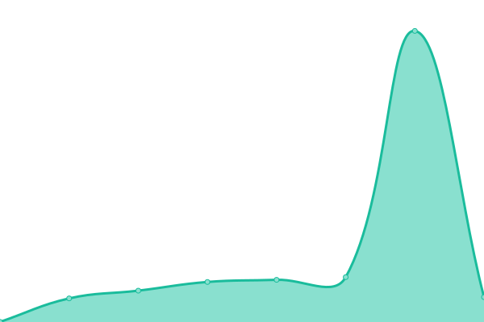
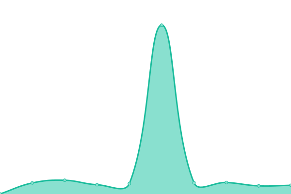

# [📈 Live Status](https://https://github.com/BusDriver5YT/upptime.moonlightsimulations.org): <!--live status--> **🟧 Partial outage**

This repository contains the open-source uptime monitor and status page for [BusDriver5](https://https://github.com/BusDriver5YT/upptime.moonlightsimulations.org), powered by [Upptime](https://github.com/upptime/upptime).

With [Upptime](https://upptime.js.org), you can get your own unlimited and free uptime monitor and status page, powered entirely by a GitHub repository. We use [Issues](https://github.com/BusDriver5/upptime.moonlightsimulations.org/issues) as incident reports, [Actions](https://github.com/BusDriver5/upptime.moonlightsimulations.org/actions) as uptime monitors, and [Pages](https://https://github.com/BusDriver5YT/upptime.moonlightsimulations.org) for the status page.

<!--start: status pages-->
<!-- This summary is generated by Upptime (https://github.com/upptime/upptime) -->
<!-- Do not edit this manually, your changes will be overwritten -->
<!-- prettier-ignore -->
| URL | Status | History | Response Time | Uptime |
| --- | ------ | ------- | ------------- | ------ |
|  [Moonlight Simulations](https://www.moonlightsimulations.org) | 🟩 Up | [moonlight-simulations.yml](https://github.com/BusDriver5YT/upptime.moonlightsimulations.org/commits/HEAD/history/moonlight-simulations.yml) | 

 309ms
     
 | 

<a href="https://upptime.moonlightsimulations.org/history/moonlight-simulations">100.00%</a>
    

|  [MSRP Server & Admin Panel](http://roleplay.moonlightsimulations.org:3041) | 🟥 Down | [msrp-server-and-admin-panel.yml](https://github.com/BusDriver5YT/upptime.moonlightsimulations.org/commits/HEAD/history/msrp-server-and-admin-panel.yml) | 

 1196ms
     
 | 

<a href="https://upptime.moonlightsimulations.org/history/msrp-server-and-admin-panel">98.02%</a>
    

|  [Moonlight Simulations Cad](http://cad.moonlightsimulations.org) | 🟩 Up | [moonlight-simulations-cad.yml](https://github.com/BusDriver5YT/upptime.moonlightsimulations.org/commits/HEAD/history/moonlight-simulations-cad.yml) | 

 526ms
     
 | 

<a href="https://upptime.moonlightsimulations.org/history/moonlight-simulations-cad">100.00%</a>
    

<!--end: status pages-->

[**Visit our status website →**](https://https://github.com/BusDriver5YT/upptime.moonlightsimulations.org)

## 📄 License

- Powered by: [Upptime](https://github.com/upptime/upptime)
- Code: [MIT](./LICENSE) © [Anand Chowdhary](https://anandchowdhary.com), supported by [Pabio](https://pabio.com)
- Data in the `./history` directory: [Open Database License](https://opendatacommons.org/licenses/odbl/1-0/)
